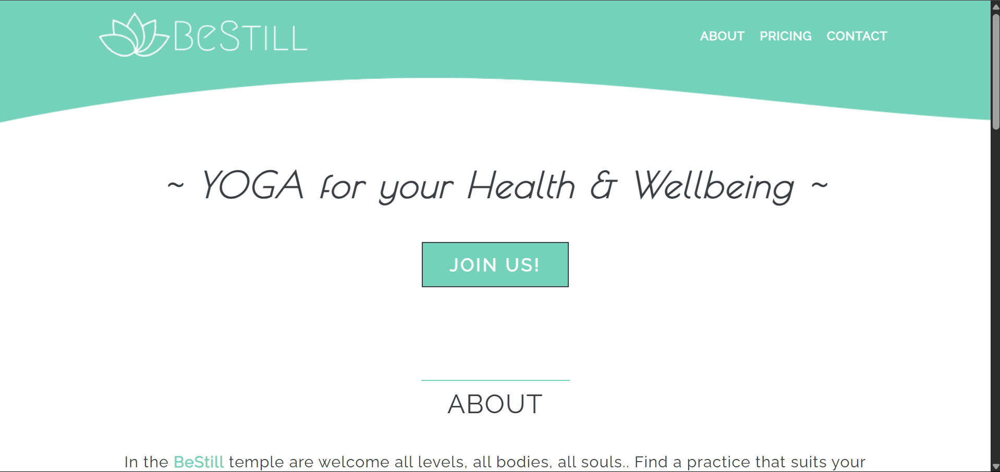
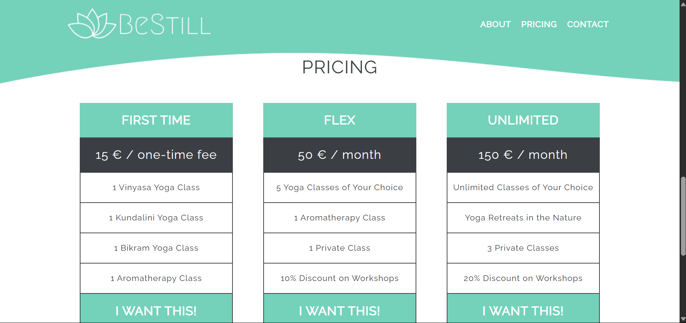
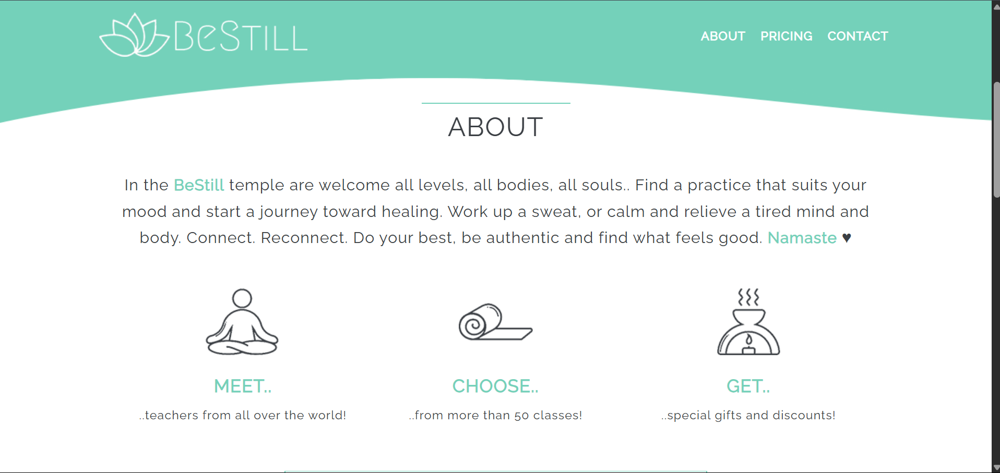

# BeStill Yoga - Product Landing Page

Welcome to the **BeStill Yoga** product landing page! This project is a responsive web page designed to showcase the offerings of a yoga studio. It includes sections for navigation, an introduction, pricing plans, and a contact form.

## Features

- **Responsive Design**: The page is fully responsive and adapts to desktop, tablet, and mobile layouts.
- **Navigation Bar**: A fixed navigation bar for easy access to different sections of the page.
- **About Section**: Highlights the studio's philosophy and offerings with engaging text and icons.
- **Pricing Plans**: Displays three pricing tiers with detailed descriptions.
- **Embedded Video**: Includes a YouTube video to provide a visual introduction to the studio.
- **Contact Form**: A simple form for users to sign up for updates and more information.

## Technologies Used

- **HTML5**: For the structure of the page.
- **CSS3**: For styling and responsive design.
- **Google Fonts**: For custom typography.
- **External Resources**: Includes images and icons hosted on GitHub.

## Screenshots

Here are some screenshots of the project:

## How to Use

1. Clone the repository to your local machine.
2. Open `index.html` in your browser to view the page.
3. Modify `styles.css` to customize the design as needed.

## Credits

- Crafted by **@amanhaidry**.
- Icons and images sourced from external resources.
- Fonts provided by [Google Fonts](https://fonts.google.com/).

## License

This project is open-source and available under the MIT License.
